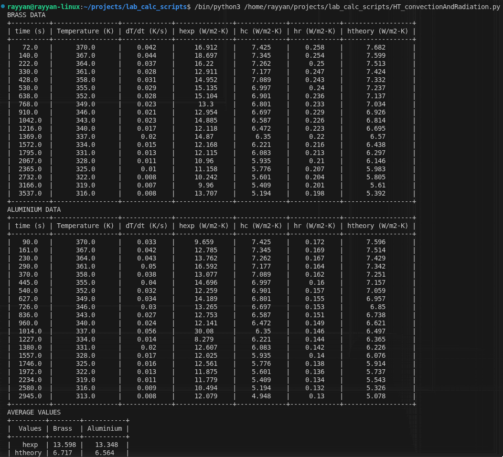

### Heat transfer coefficient value calculation script for HT Lab

Download the python script and run it (for finer details check the code itself)

Note: Requires **numpy** and **PrettyTable** libraries

```
pip install numpy
```
```
python -m pip install -U prettytable
```

The script outputs a nicely formatted table that can be directly copied into those damn record/assignment sheets, thank me later.

Example:
